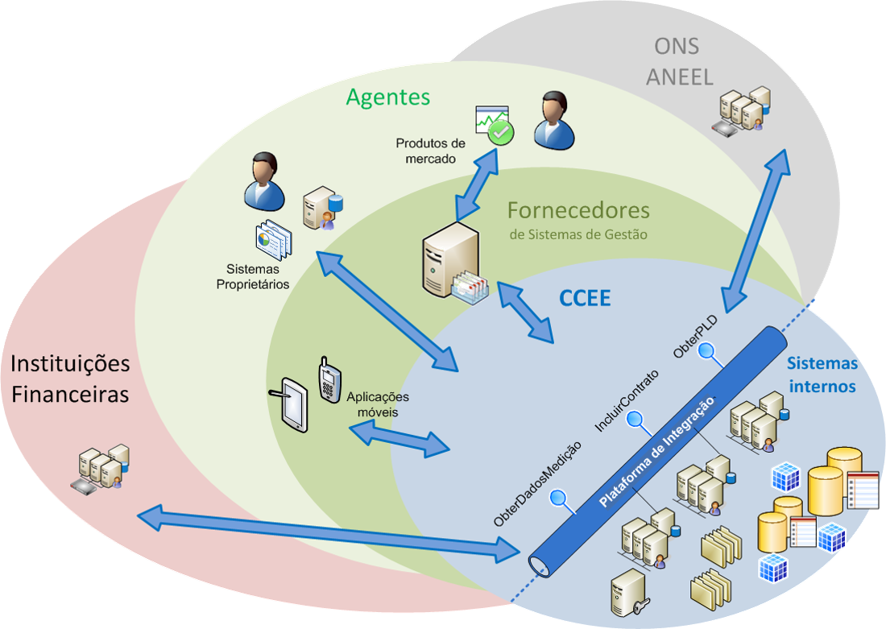
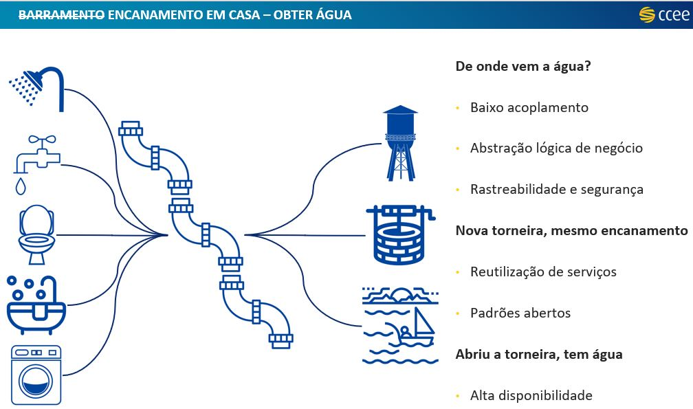
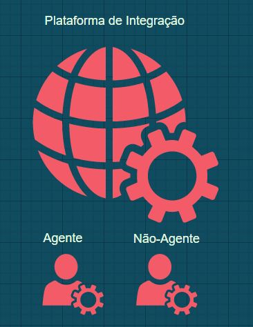
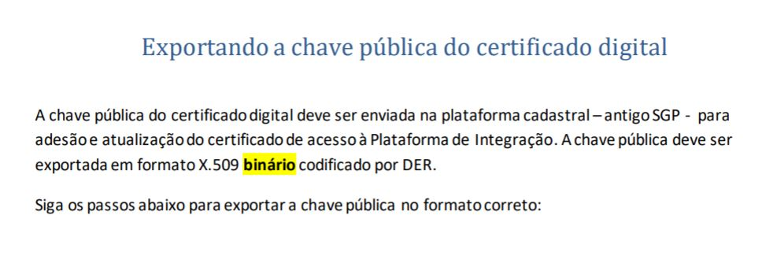
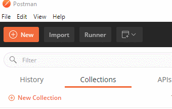
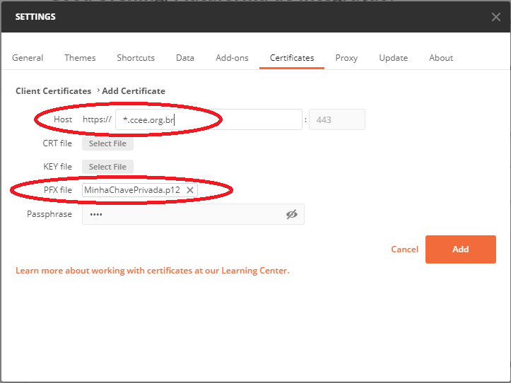

# Guia prático: O primeiro uso da Plataforma de Integração 

Para você que chegou até aqui e está curioso em como utilizar os serviços/API´s disponibilizado(a)s pela CCEE ao mercado,
fique até o final deste guia para descobrir:

+ O que é a plataforma de integração? 
+ Quem pode acessar a plataforma de integração?
+ O que é o ambiente piloto?
+ O que preciso para acessar à Plataforma de Integração?
+ Quais as características do certificado digital? 
+ Quais certificados digitais não são válidos? 
+ Como cadastrar o certificado digital nos nossos sistemas? 
+ Como é feita a autenticação à plataforma de integração? 
+ Como configurar a autenticação mútua no Postman? 
+ O que significa o código de perfil de agente?
+ Como validar a conexão após receber o usuário e senha sistêmicos? 
+ Como abrir chamados para a ccee referente a erros/dúvidas sobre os serviços da Plataforma?

## O QUE É A PLATAFORMA DE INTEGRAÇÃO?

Plataforma tecnológica que viabiliza a integração segura entre os sistemas de informação da CCEE e os demais participantes do mercado de energia, propiciando aumento de produtividade e redução de custos e riscos operacionais, conforme figura abaixo.

Abstraindo o conceito de "Barramento" de serviços, se você precisasse obter água do encanamento da sua casa você teria este cenário:

---
 
## Quem pode acessar a plataforma de integração?

 

Todos os agentes e não-agentes aderidos à CCEE. Caso queira consultar informações em nome de outro agente que não esteja aderido à plataforma de integração é necessário que tenha representação operacional total do agente representado.  

--- 
## O que é o ambiente piloto?

Um ambiente de teste que pode ser utilizado pelos agentes para testar e conhecer os serviços disponibilizados no ambiente produtivo da plataforma de integração.
Vocês podem cadastrar novos contratos sem alterar as informações contidas no ambiente produtivo, aprender como consultar as medições dos agentes antes, aprender a consultar os preços com o serviço de PLD entre outras funcionalidades.
Todos os serviços que estão em produção estão no piloto com exceção da DRI por exigir um alto processamento do ambiente.

- Diferença de produção: 1 mês.
- Quando ele é atualizado: sempre no primeiro sábado do mês corrente.
- Maneira como é acessado - Igual produção, ou seja com os mesmos usuario, senha e certificado.
- Disponibilidade não é 24/7 por possui menos recursos computacionais comparado com produção.
- Caso encontrem algum erro, favor abrir chamado para E-mail: atendimento@ccee.org.br, com o Assunto Erro no Ambiente piloto.

---
 
## O que preciso para acessar à Plataforma de Integração?

Para acessar os serviços por meio da Plataforma você irá precisar:

+ Liberar o firewall para comunicação com as portas 442 e 443 no endereço https://servicos.ccee.org.br/ (para o ambiente produtivo) e no endereço https://piloto-servicos.ccee.org.br/ (para o ambiente piloto).
+ Aderir à plataforma de integração, de acordo com o [manual de adesão/atualização de certificado](https://www.ccee.org.br/documents/80415/919484/Ades%C3%A3o%20e%20Atualiza%C3%A7%C3%A3o%20Certificado%20e%20Senha%20Plataforma%20de%20Integra%C3%A7%C3%A3o%20no%20SGP_1.pdf/2cf3ef8e-16f5-2a17-9e7a-76abd25e1417).
+ Utilizar o usuário e senha recebidos por e-mail após a conclusão da adesão a Plataforma de Integração;
+ Utilizar a chave PRIVADA, geralmente possui extensão (*.pfx, *.p12, entre outras) do certificado aderido para realizar a comunicação com a CCEE;
+ Informar o código perfil de agente.

Para utilizar os serviços da plataforma de integração, fazemos duas verificações:

1. Autenticação - Validamos se o usuário e senha sistêmicos e certificado digital estão corretos. 
2. Autorização - Utilizamos o código do perfil de agente, contido no "Header" da mensagem enviada para identificar em nome de qual perfil de agente o usuário logado está tentando acessar.

Você só pode utilizar o seu código perfil ou dos agentes que você representa operacionalmente para fazer as requisições na Plataforma. Caso contrário o erro **"Rejected: Usuario não está autorizado a usar o codigoPerfilAgente"** será retornado.

---

## Quais as características do certificado digital?

- Certificado para Servidor Web – SSL
- Hierarquia: ICP-Brasil
- Tamanho da chave: RSA 2048 bits
- Data de Expiração menor que 395 dias
- Algoritmo do certificado: SHA 2 (256) ou SHA 2 (512)
- Requerente (subject) precisa ser único por certificado

A CCEE utiliza apenas os atributos listados acima para realizar a autenticação mútua. Os demais atributos do certificado podem ser utilizados conforme a preferência dos agentes.

#### Importante:

Caso não submeta o arquivo neste formato, um erro de "CERTIFICADO EXPIRADO" na tela do SGP poderá ocorrer.

[Manual de Adesão/Atualização](https://www.ccee.org.br/documents/80415/919484/Ades%C3%A3o%20e%20Atualiza%C3%A7%C3%A3o%20Certificado%20e%20Senha%20Plataforma%20de%20Integra%C3%A7%C3%A3o%20no%20SGP_1.pdf/2cf3ef8e-16f5-2a17-9e7a-76abd25e1417).

---
 
## Quais certificados digitais não podem ser utilizados?

- Não é um certificado para sites.
- Não é um certificado A1 onde a assinatura fica armazenada no próprio computador do usuário.
- Não é um certificado A3 onde a assinatura fica armazenada em mídias portáteis, tais como token USB ou cartões com chip.
- Não é um certificado de Emissão Nota Fiscal. 
- Não é um e-CPF.

--- 

## Como cadastrar o certificado digital nos nossos sistemas?

Para cadastrar o certificado digital você irá utilizar a chave-pública que geralmente possui a extensão (*.cer, *.crt, entre outras).

O cadastro inicial, assim como também a atualização ANUAL da chave-pública e o seu passo-a-passo para aderir à plataforma de integração é descrita neste [Manual de Adesão](https://www.ccee.org.br/documents/80415/919484/Ades%C3%A3o%20e%20Atualiza%C3%A7%C3%A3o%20Certificado%20e%20Senha%20Plataforma%20de%20Integra%C3%A7%C3%A3o%20no%20SGP_1.pdf/2cf3ef8e-16f5-2a17-9e7a-76abd25e1417).

---
 
## Como é feita a autenticação à plataforma de integração?

A autenticação realizada pela plataforma é a autenticação mútua,

Para maiores informações consultar [manual de autenticacao](https://www.ccee.org.br/documents/80415/919484/Autenticacao.pdf/5960714a-70e2-6c8d-9801-233fb34fb0fe).

---

## Como Configurar autenticação SSL mútua no Postman {#ccamnp}

Um dos requisitos para autenticação nos serviços da Plataforma de Integração é a autenticação SSL mútua. Isso quer dizer que, ao acessar os web services da CCEE, será necessário utilizar uma chave privada de um certificado previamente cadastrado na Plataforma de Integração.

Os passos abaixo mostram como configurar sua chave privada no Postman:

1. Verique se tem acesso à sua chave privada, em arquivo no formato *.PFX, *.P12, *.JKS ou similar

2. No Postman, acesse _File > Settings_

3. Adicione o arquivo com sua chave privada no campo _PFX File_, informando a senha do arquivo, e adicione o endereço o valor **_*.ccee.org.br_** no campo _Host_

## O que significa o código de perfil de agente??

O código de perfil do agente representa o número do perfil do agente. O perfil é uma forma de diferenciar o tratamento atribuído na contabilização entre usinas e cargas de um mesmo agente. Por exemplo, um mesmo agente pode ter uma usina com energia incentivada e outra com energia convencional, tendo os tratamentos adequados na contabilização para tipo de energia. Já para cargas aplica-se o mesmo conceito, perfis diferentes permite que sejam contabilizadas cargas com características diferentes, como por exemplo cargas sujeitas a desconto ou sem desconto.

+ Cuidado para não confundir o código do agente com o código do perfil de agente. 

Sua consulta pode ser feita através da plataforma cadastral, como também da planilha [Infomercado Dados Cadastrais](https://www.ccee.org.br/documents/80415/919444/InfoMercado_Dados_Individuais-Jan2022.xlsx/01bdd7c7-9a3a-5c46-ef6b-bcb8c48e7daa), encontrada nos documentos da [CCEE](https://www.ccee.org.br/web/guest/acervo-ccee). E através da consulta do através do serviço [Perfil Participante Mercado](https://www.ccee.org.br/documents/80415/919484/ListarPerfilParticipanteMercadoV2.pdf/da2fb02d-14e1-7a95-5663-70b83839b665).

Esta informação é necessária ser enviada no "Header" de todas as requisições da plataforma de integração.

---
 
## Como validar a conexão após receber o usuário e senha sistêmicos?

Os Serviços foram criados para serem acessados por outros sistemas, através da troca de mensagens o que facilita o acesso as informações, mitigando erros que podem ser provenientes de atividades manuais. 
Existem algumas ferramentas no mercado específicas para testar os serviços ou APIs, tais como [SoapUi](https://www.soapui.org/downloads/soapui/), [Postman](https://www.postman.com/downloads/), entre outros. Através delas os agentes conseguem validar a conexão com o serviço de interesse enquanto desenvolve a sua solução. 

A CCEE não presta suporte sobre o uso da ferramenta Postman, mas disponibiliza uma coleção de exemplos de chamada dos serviços existentes na plataforma para consulta e utilização entre os agentes.

Para fazer isso siga os passos abaixo:  
- **Escolha um serviço de interesse** - [Clique aqui](https://www.ccee.org.br/web/guest/documentos/plataforma-de-integracao).

- **Configure a autenticação via postman** - [Clique aqui](https://github.com/devccee/postman-collections).
Mais detalhes na sessão - Como Configurar autenticação SSL mútua no Postman

- **Navegue pelos exemplos de consulta desejados para o serviço alvo** - [Clique aqui](https://documenter.getpostman.com/view/12351215/TVCdzTxD#146bf629-a415-4972-afe0-42e6e78c0021)

- **Não esqueça de conferir se as credenciais do usuário e senha sistêmicos estão corretamente configuradas e se é necessário inserir o código de perfil de agente principal no Header da chamada**.

---
 
### Como abrir chamados para a ccee referente a erros/dúvidas sobre os serviços da Plataforma?

+ Telefones: 0800 881 2233 ou 0800 72 15 445
+ E-mail: atendimento@ccee.org.br

Basta enviar um e-mail para o endereço ou ligar para o telefone acima.

Ao criar um chamado sobre algum serviço ou problema específico, anexar os __arquivos__ __xml__ __da__ __chamada__ __de__ __serviço__ __e__ __da__ __resposta__, contendo o campo "transactionId".
Através deste campo conseguimos rastrear a sua mensagem aqui nos nossos arquivos de log para uma análise efetiva do seu problema. 
Se ainda sentir que falta alguma coisa para entendimento completo do chamado, adicione __"prints__ __de__ __tela__" em anexo.

--- 
## Referências

- [Plataforma de integração](https://www.ccee.org.br/web/guest/documentos/plataforma-de-integracao).
- [CCEE](https://www.ccee.org.br/web/guest).

